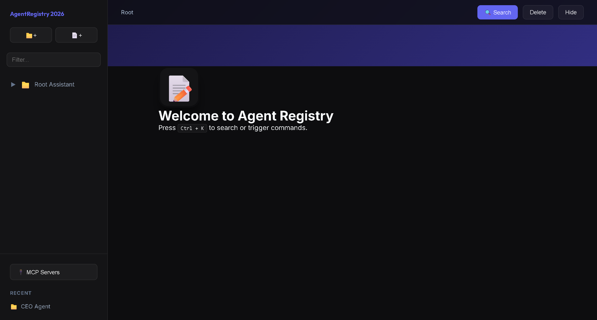
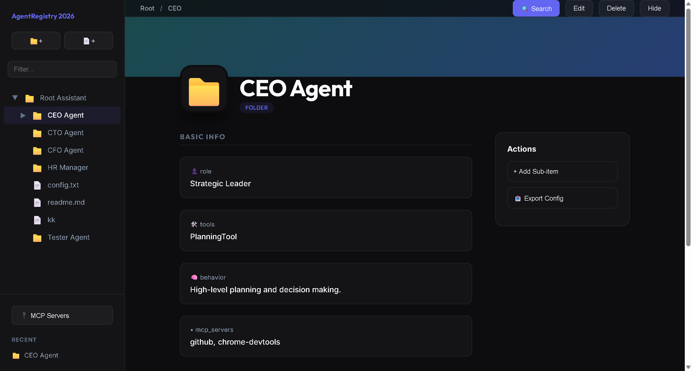

# AgentRegistry 2026



AgentRegistry is a Vite and TypeScript application for browsing, editing, and chatting with a hierarchical registry of agents and context files.



## Features

- Hierarchical agent/file explorer backed by `public/registry.json`.
- Agent detail dashboards with properties, child items, and MCP capabilities.
- Per-agent chat history persisted with the registry.
- In-browser speech-to-text for chat using `onnx-community/whisper-tiny.en`.
- Command palette with `Ctrl + K`, keyboard navigation, and recent items.
- File editing with persisted saves.
- MCP server manager backed by `public/mcp_servers.json`.
- Dev and production save APIs for registry and MCP configuration.

## Quick Start

### Local Development

```bash
npm install
npm run dev
```

Then visit the local URL printed by Vite.

### Production Build

```bash
npm run build
node server.js
```

The production server serves the built app from `dist/`, reads live data from `public/`, and exposes:

- `POST /api/save`
- `POST /api/save-mcp`
- `GET /registry.json`
- `GET /mcp_servers.json`

### Docker

```bash
docker build -t agent-registry .
docker run -p 3000:3000 agent-registry
```

## Keyboard Shortcuts

- `Ctrl + K`: open command palette
- `N`: new agent in the selected folder, or root if no folder is selected
- `F`: new file in the selected folder, or root if no folder is selected
- `Esc`: close modals or palette
- `Up` / `Down`: navigate palette results
- `Enter`: select the active palette result

## Project Structure

- `src/models`: data loading, lookup, mutation, and save logic
- `src/views`: DOM rendering components
- `src/controllers`: app state and event orchestration
- `public`: editable JSON data files and static assets
- `index.pug`: source template for `index.html`
- `server.js`: production server and save API

## Persistence

During development, the Vite plugin in `vite.config.ts` writes changes to `public/registry.json` and `public/mcp_servers.json`. In production, `server.js` writes the same files. For container deployments, mount `public/` as a volume if you want changes to survive rebuilds.

## Browser Speech

Chat voice input runs locally in the browser through `@huggingface/transformers`. The model is loaded lazily on first use, so the initial app load stays small. WebGPU is preferred when available; otherwise the app falls back to the WASM backend.
